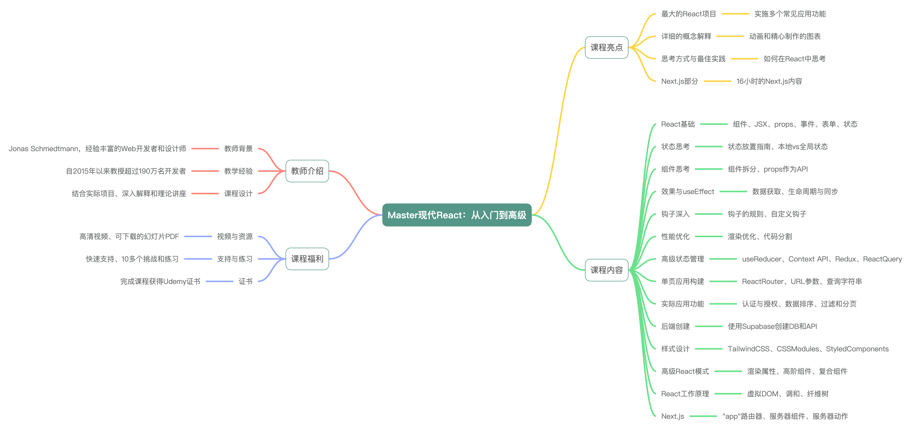

# react-notes
For beginner

## EN

Course Title: Master modern React from beginner to advanced!

Course Highlights:
- Largest and Most Professional Project: Implement many common app features.
- Super Detailed Explanations: All important concepts with carefully crafted and animated diagrams.
- Focus on "How to Think in React": Modern best practices.
- Behind-the-Scenes of React: Long section exploring how React works.
- Advanced Design Patterns: Compound components to think like a senior React engineer.
- Next.js Content: 16 hours of Next.js with modern "app" router, React Server Components, and Server Actions.

Instructor: Jonas Schmedtmann, experienced web developer and designer, Udemy's top instructor with over 1,900,000 students.

Course Content:
- React Fundamentals: Components, JSX, props, events, forms, state, props vs. state.
- State Management: Where to place state, guidelines, lifting state up, local vs. global state, UI vs. remote state.
- Component Thinking: How to split components, props as API, building reusable and composable components.
- Effects and useEffect: Data fetching, lifecycle vs. synchronization, when to use effects, effects vs. event handlers.
- Hooks: Rules of hooks, how hooks work, useRef, building super-reusable custom hooks.
- Performance Optimization: Wasted renders, memoization with memo, useMemo, useCallback, optimizing Context API, code splitting + Suspense.
- Advanced State Management: useReducer hook, Context API, Redux, Redux Toolkit, Thunks, ReactQuery.
- Single-Page Applications (SPA): Vite, routing with React Router, URL parameters and query strings for state management, data loaders and actions (v6.4+).
- Real-World Features: Authentication and authorization, data sorting, filtering, and pagination, dark mode, dashboard with charts.
- Back-End with Supabase: Create a DB and API, build full-stack apps.
- Styling: Tailwind CSS, CSS Modules, Styled Components.
- Advanced React Patterns: Render props, higher-order components, compound components (modal, context menu).
- How React Works: Rendering, virtual DOM, reconciliation, fiber tree, key prop, events, state batching.
- Next.js: "App" router, React Server Components, Server Actions, server-side rendering, static vs. dynamic rendering, state management between server and client, data loading strategies, streaming, caching, image and font optimization, authentication with NextAuth, modern React hooks (useFormState and useOptimistic).

Course Benefits:
- HD-Quality Videos: Easy to search and reference.
- Downloadable Slides: PDF for 70+ theory videos.
- Professional Captions: Not auto-generated.
- Downloadable Assets: Starter and final code for each project.
- Fast Support: In the course Q&A.
- Challenges and Exercises: Practice your skills (solutions included).

Learning Outcomes:
- Advanced React Developer: Build 10+ beautiful projects, including two huge professional real-world apps.

- Job-Ready: Work with libraries and tools used in professional projects.

- Think Like a Senior Engineer: With advanced design patterns.

- Next.js "App" Router: With cutting-edge React Server Components + Server Actions.

- State Management: Thinking about state, where to place, local vs. global, UI vs. remote.

- Reusable and Composable Components: Build versatile components.

- Master useEffect: Once and for all.

- Custom Hooks: Reusable in your future projects.

- SPA with React Router: Including v6.4+ with data loading.

- Performance Optimization: With memo, useMemo, useCallback, and code splitting.

- Advanced React Features: useReducer, Context API, cloneElement, portals.

- Advanced State Management: Redux, Redux Toolkit, Thunks, ReactQuery.

- Real-World App Features: Authentication, data sorting, filtering, and pagination, dark mode, charts.

- Understand React: Virtual DOM, reconciliation, fiber tree, key prop.

- Style Apps: With Tailwind CSS, CSS Modules, Styled Components (CSS-in-JS).

- Practice Skills: With many challenges, exercises, and practice projects. 

  

## ZH-CN

1. 课程概述：
   - 课程名称：Master modern React from beginner to advanced!
   - 教学平台：Udemy
   - 讲师：Jonas Schmedtmann
   - 课程评级：4.7/5
   - 更新时间：2024年12月
   - 语言：英语
2. 课程特色：
   - 全面性：涵盖React、Next.js、Context API、ReactQuery、Redux、Tailwind等现代前端开发工具和库。
   - 实践性强：通过构建多个高质量的实际项目来学习React，包括两个大型专业应用。
   - 深入讲解：提供详细的理论和概念解释，包括React内部工作原理、高级设计模式等。
   - 最新技术：包含16小时的Next.js额外内容，涉及现代“app”路由、React Server Components和Server Actions。
3. 课程内容：
   - React基础：组件、JSX、props、事件、表单、状态等。
   - 状态管理：状态放置指南、提升状态、局部与全局状态、UI与远程状态。
   - 组件设计：组件拆分、props作为API、构建可重用和可组合的组件。
   - 性能优化：避免不必要的渲染、使用memoization、useMemo和useCallback优化Context API、代码分割与Suspense。
   - 高级状态管理：useReducer钩子、Context API、Redux、Redux Toolkit、Thunks、ReactQuery。
   - 单页应用构建：使用Vite和React Router进行路由管理、URL参数和查询字符串管理、数据加载器和动作。
   - 真实应用功能：认证和授权、数据排序、过滤和分页、暗模式、带图表的仪表板等。
   - 后端构建：使用Supabase创建带数据库和API的后端，实现全栈应用开发。
   - 样式设计：使用Tailwind CSS、CSS Modules和Styled Components进行样式设计。
   - 高级React模式：渲染属性、高阶组件、复合组件（如模态对话框、上下文菜单等）。
   - React工作原理：渲染、虚拟DOM、协调、纤维树、key属性、事件、状态批处理等。
4. 讲师介绍：
   - 讲师：Jonas Schmedtmann
   - 背景：经验丰富的Web开发人员和设计师，Udemy顶级讲师之一，自2015年以来已教授超过190万名开发者。
   - 教学方法：结合真实项目、深入解释和理论讲座，旨在几周内将学生培养成自信的React和Next.js开发者。
5. 学习目标：
   - 成为高级React开发者：从零开始学习React，构建10多个高质量项目。
   - 就业准备：学习专业项目中的库和工具，提升就业竞争力。
   - 高级设计模式：学习像高级React工程师一样思考，使用高级设计模式。
   - Next.js应用：掌握Next.js“app”路由、React Server Components和Server Actions。
   - 状态管理：深入理解状态管理，包括局部与全局状态、UI与远程状态。
   - 组件构建：学习构建可重用、可组合和通用的React组件。
   - 性能优化：掌握性能优化技巧，如使用memo、useMemo和useCallback进行代码分割。
   - 高级React特性：学习useReducer、Context API、cloneElement、portals等高级特性。
   - 样式设计：使用Tailwind CSS、CSS Modules和Styled Components进行样式设计。
   - 实践练习：通过多个挑战、练习和实践项目提升技能。
6. 课程要求：
   - 无React经验要求：适合初学者，从基础到高级全面覆盖。
   - JavaScript基础：需要具备基本的JavaScript理解，课程包含快速复习部分。
   - 设备要求：任何电脑和操作系统（Windows、macOS或Linux）均可。
7. 适合人群：
   - 刚学完JavaScript并希望继续深造的学生。
   - 希望真正掌握React开发，包括构建真实世界应用所需常见库的学生。
   - 已经学习React但仍不自信构建专业React应用的学生。
   - 已经构建React应用但缺乏高级知识的学生，如性能优化、React工作原理、高级设计模式等。

这篇文章为希望从零开始学习React并成为高级React开发者的学生提供了全面的课程介绍，通过丰富的实践项目和深入的理论讲解，帮助学生掌握现代前端开发的必备技能。 
